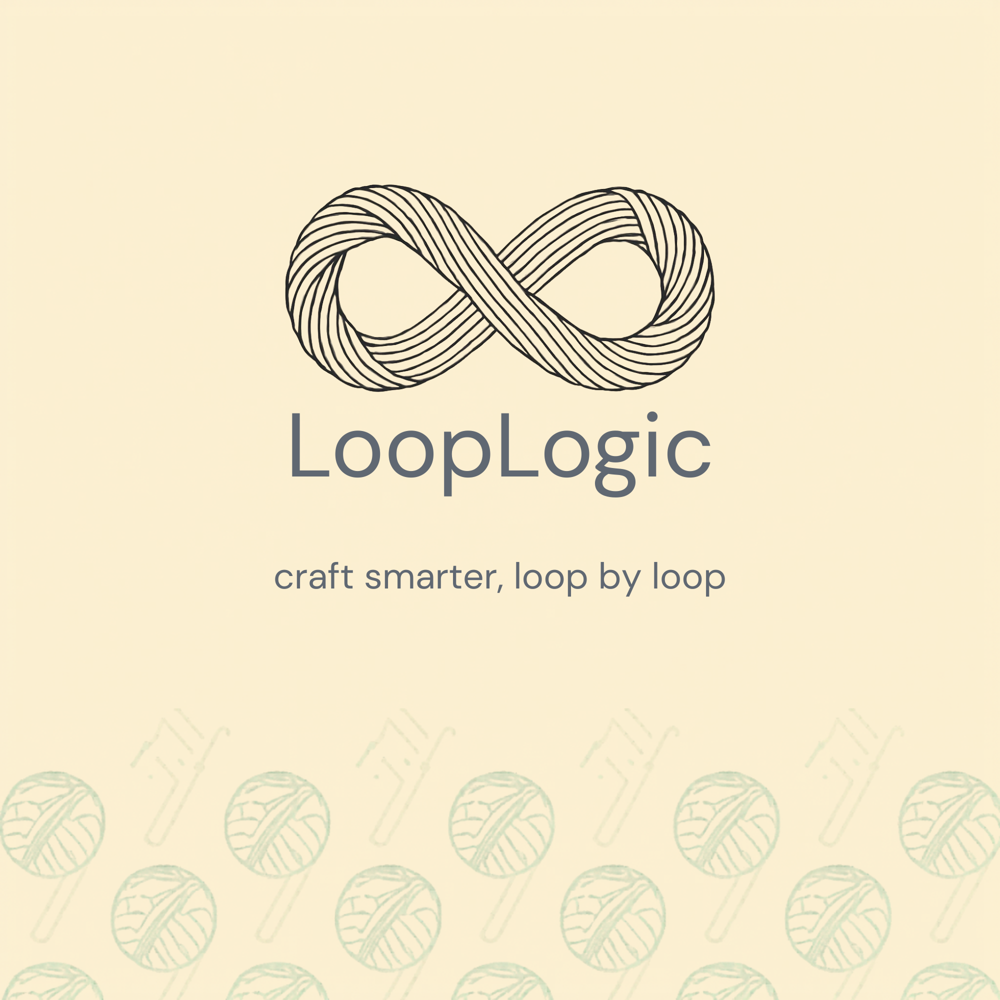

  

LoopLogic is a Shiny application designed to support crocheters and knitters through multiple stages of the crafting process. 

LoopLogic includes tools for both knitters and crocheters. 

For knitters, the application features a stitch calculator that determines the appropriate cast-on stitch count based on a user’s gauge to maintain pattern accuracy, as well as a calculator that estimates the resulting bust circumference of a sweater, blouse, or top when the user’s gauge differs from the pattern gauge.
For crocheters, the application provides an interactive interface that converts uploaded crochet graphs into written instructions, supporting efficient workflow development for tapestry crochet projects.
